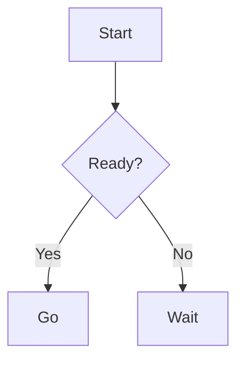

# @mammothb/pi-mermaid

Pi extension that renders Mermaid diagrams as ASCII art in the TUI, plus a skill that teaches the LLM to generate Mermaid syntax.

## Features

- **Extension**: Auto-detects ` ```mermaid ` blocks in assistant responses and renders them as ASCII diagrams
- **Width-aware**: Selects from 4 rendering presets (default/compact/tight/squeezed) based on terminal width
- **Validation**: Parses Mermaid syntax via the official parser and reports errors
- **Collapsible**: Large diagrams show first 10 lines with an expand hint
- **Command**: `/pi-mermaid` manually re-renders the last assistant message
- **Skill**: Teaches the LLM to write correct Mermaid syntax across 12+ diagram types

## Supported Diagram Types

- Flowchart, Sequence, Class, State, ER, Gantt, Pie, Git Graph, Mindmap, Timeline, C4, User Journey

## Install

```bash
pi install npm:@mammothb/pi-mermaid
```

## Usage

Just include Mermaid blocks in your prompts — the extension auto-renders them:

````

````

Or use the command to render the last assistant message:

```
/pi-mermaid
```
