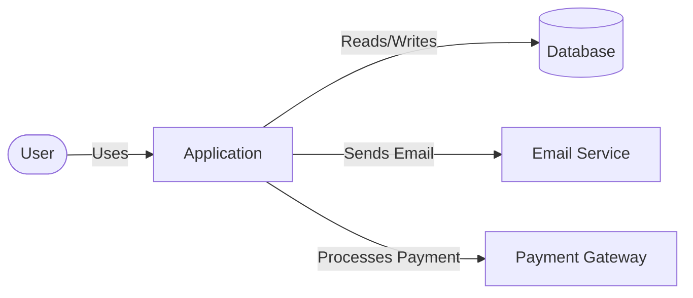
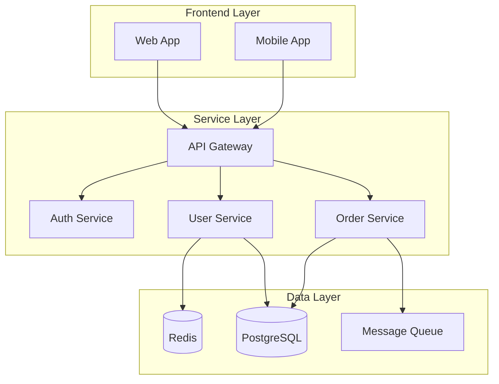
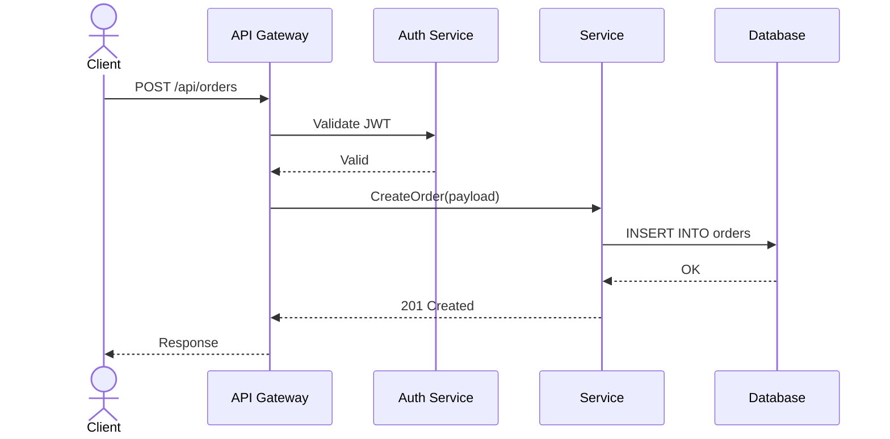
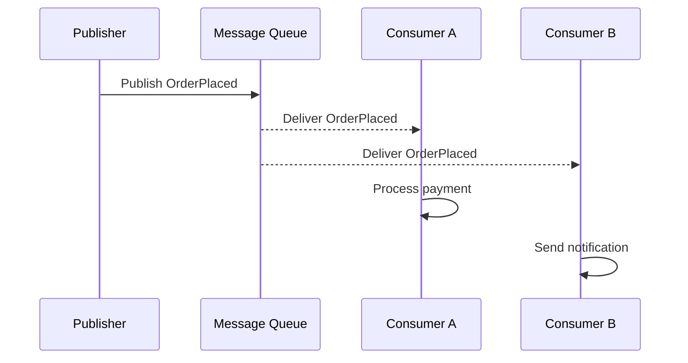
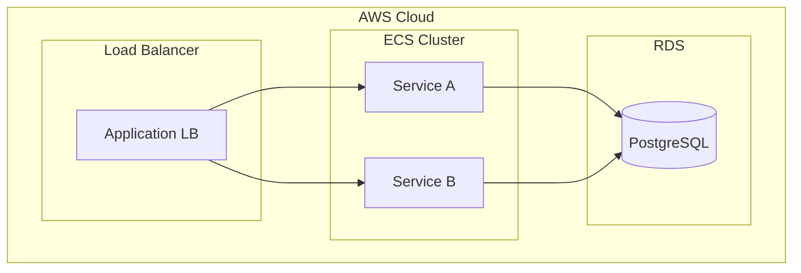

# Architecture Diagram Patterns

Use flowchart and sequence diagrams for architecture documentation. This reference shows how to map common architecture views to these two diagram types.

## Pattern Selection

| Architecture Need | Diagram Type | Rationale |
|------------------|--------------|-----------|
| System Context (who/what interacts) | Flowchart | Boxes for systems/actors, edges for relationships |
| Service Topology | Flowchart | Subgraphs for bounded contexts, edges for dependencies |
| Data Flow | Flowchart | Nodes for processing steps, edges for data movement |
| Deployment Topology | Flowchart | Subgraphs for hosts/environments, nested nodes for services |
| Request Tracing | Sequence | Lifelines for services, messages for calls |
| Auth Flows | Sequence | Participants for client/auth/resource, messages for tokens |
| Event Chains | Sequence | Messages with labels for event types |

## System Context (Flowchart)

Key conventions:
- Use rounded shapes `([ ])` for human actors, rectangles `[ ]` for systems
- Use cylinder `[( )]` for databases
- Edge labels describe the relationship or data direction
- Left-to-right (`LR`) for system context with few nodes

## Service Topology (Flowchart with Subgraphs)

Key conventions:
- Subgraphs with semantic titles (Frontend, Services, Data)
- Layout from top to bottom (`TD`) for layered architectures
- Group related services in subgraphs
- Explicit edge labels for protocol or data direction when ambiguous

## API Request Flow (Sequence)

Key conventions:
- Use `actor` for frontend/mobile clients, `participant` for backend services
- `->>` for synchronous calls, `-->>` for responses
- Label messages with HTTP method + path or function calls
- Keep lifeline ordering left-to-right = call depth

## Event-Driven Flow (Sequence)

## Multi-Level Architecture (Flowchart)

For showing both deployment and service relationships:

