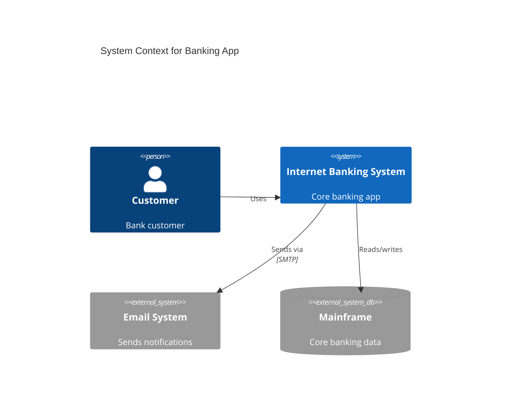

# C4 Diagram Reference

C4 diagrams model software architecture at four levels: Context, Container, Component, and Code. Mermaid supports the first three plus Dynamic and Deployment.

## Diagram Types

| Keyword | Use |
|---------|-----|
| `C4Context` | System context (systems + actors) |
| `C4Container` | Containers within a system (apps, databases) |
| `C4Component` | Components within a container |
| `C4Dynamic` | Dynamic flow / sequence of calls |
| `C4Deployment` | Deployment nodes and infrastructure |

## Element Types

```
Person(alias, label, ?description)
Person_Ext(alias, label, ?description)       %% External person
System(alias, label, ?description)
SystemDb(alias, label, ?description)          %% Database
SystemQueue(alias, label, ?description)       %% Queue
System_Ext(alias, label, ?description)        %% External system
SystemDb_Ext(alias, label, ?description)
SystemQueue_Ext(alias, label, ?description)
Container(alias, label, ?technology, ?description)
ContainerDb(alias, label, ?technology, ?description)
Container_Ext(alias, label, ?technology, ?description)
Component(alias, label, ?technology, ?description)
Deployment_Node(alias, label, ?type, ?description)
Node(alias, label, ?type, ?description)       %% Alias for Deployment_Node
```

## Boundaries

```
Boundary(alias, label, ?type)
Enterprise_Boundary(alias, label)
System_Boundary(alias, label)
Container_Boundary(alias, label)
```

Boundaries are nesting containers. Place elements inside with braces:
```
Boundary(b1, "Core") {
    System(sysA, "Service A")
    SystemDb(db, "Database")
}
```

## Relationships

```
Rel(from, to, label, ?technology)
BiRel(from, to, label)                        %% Bidirectional
Rel_Back(from, to, label)
Rel_U(from, to, label)                        %% Up
Rel_D(from, to, label)                        %% Down
Rel_L(from, to, label)                        %% Left
Rel_R(from, to, label)                        %% Right
```

## Styling

```
UpdateElementStyle(alias, $bgColor="grey", $fontColor="red", $borderColor="red")
UpdateRelStyle(from, to, $textColor="blue", $lineColor="blue", $offsetX="10", $offsetY="-20")
UpdateLayoutConfig($c4ShapeInRow="3", $c4BoundaryInRow="1")
```

## HTML in Descriptions

Use `<br/>` for line breaks in descriptions:
```
Person(user, "User", "A customer of the bank, <br/> with personal accounts.")
```

## Common Pitfalls

| Problem | Cause | Fix |
|---------|-------|-----|
| Element not found in relationship | Referencing undefined alias | Define all elements before relationships |
| Boundary nesting wrong | Elements outside boundary braces | Elements must be inside `{ }` of their boundary |
| Layout looks wrong | Element order affects layout | Adjust declaration order to control positioning |
| Line breaks in desc | Multi-line descriptions | Use `<br/>` not actual newlines |
| Wrong diagram type | Using `Person` in `C4Container` | Match element types to diagram type |

## Example



## Naming Conventions

- Aliases: short, lowercase, no spaces (`customer`, `bankingApp`)
- Labels: human-readable title case (`Internet Banking System`)
- Descriptions: one-line summary of purpose
