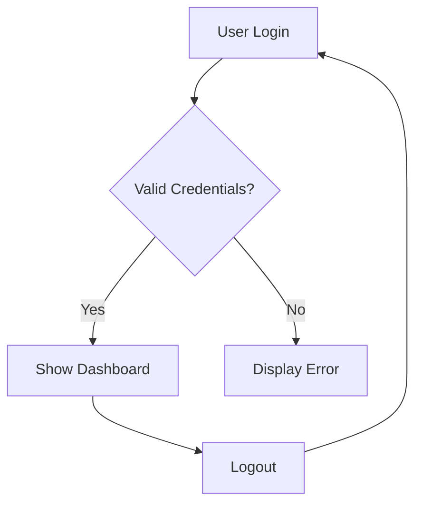

# Flowchart Reference

## Syntax

```
flowchart <direction>
    NodeId[Rectangle]
    NodeId(Rounded edges)
    NodeId([Stadium shape])
    NodeId[[Subroutine]]
    NodeId[(Database)]
    NodeId((Circle))
    NodeId>Asymmetric]
    NodeId{Diamond / Decision}
    NodeId{{Hexagon}}
    NodeId[/Parallelogram/]
    NodeId[\Alt parallelogram\]
    NodeId[/Trapezoid\]
    NodeId[\Alt trapezoid/]
```

## Direction

| Value | Direction | Use When |
|-------|-----------|----------|
| `TD` or `TB` | Top-down | Default. Layered architectures, process flows, hierarchies |
| `LR` | Left-right | System context with few nodes, horizontal layouts |
| `RL` | Right-left | Rare. Alternative layout |
| `BT` | Bottom-up | Rare. Inverted flow |

Prefer `TD` for most diagrams. Use `LR` for system context or when there are fewer than 6 nodes.

## Connections

```
A --> B            Arrow
A --- B            Line (no arrow)
A -.-> B           Dotted arrow
A ==> B            Thick arrow
A -->|text| B      Arrow with label
A --o B            Arrow with circle end
A --x B            Arrow with X end
A <--> B           Bidirectional
```

## Subgraphs

```
subgraph Title
    direction LR
    A --> B
end
```

Can nest subgraphs. Use for grouping services by layer, domain, or deployment boundary.

## Styling

```
style NodeId fill:#f9f,stroke:#333,stroke-width:2px
classDef name fill:#f96,stroke:#333
class NodeA,NodeB name
linkStyle 0 stroke:#ff3,stroke-width:4px
```

Apply only when needed for clarity. Avoid overly elaborate styling.

## Common Pitfalls

| Problem | Cause | Fix |
|---------|-------|-----|
| Parse error on `graph` keyword | Using deprecated `graph` instead of `flowchart` | Always use `flowchart`, never `graph` |
| Node ID contains spaces | IDs can't have spaces | Use CamelCase or underscores: `AuthService`, `auth_service` |
| Unclosed brackets | Missing closing bracket in node shape | Ensure every `[` has `]`, `{` has `}`, etc. |
| Special chars in label | Labels contain `"` or `]` without escaping | Use `#quot;` for quotes, avoid brackets in labels |
| Invalid edge label syntax | Space before pipe in label | Correct: `A -->|text| B`. Wrong: `A --> |text| B` |
| Long labels | Text runs off diagram | Keep labels under 30 characters |

## Node Naming Conventions

- Use descriptive, semantic IDs: `AuthService`, not `A`
- CamelCase for services: `PaymentGateway`, `UserDatabase`
- Short but clear: `OrderQueue` not `OrderProcessingMessageQueue`
- For flowcharts: noun or verb-noun: `ValidateInput`, `PaymentProcessed`

## Example


