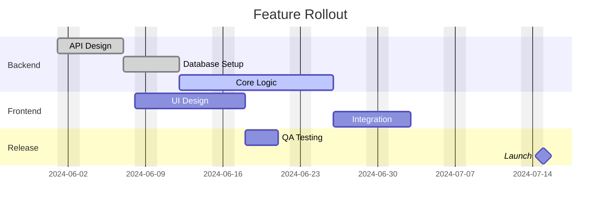

# Gantt Chart Reference

## Syntax

```
gantt
    title Project Title
    dateFormat YYYY-MM-DD
    excludes weekends
    tickInterval 1week

    section Section Name
    Task name           :status, id, start, end
    Another task        :after id, 5d
    Milestone           :milestone, m1, 2024-06-01, 0d
```

## Task Metadata

Format: `Task title :status, id, start, end`

Status tags (optional, must come first): `done`, `active`, `crit` (critical), `milestone`.

### Date/duration formats

| Syntax | Meaning |
|--------|---------|
| `2024-01-01, 2024-01-10` | Explicit start and end |
| `2024-01-01, 30d` | Start + duration |
| `after taskId, 10d` | After another task + duration |
| `30d` | Duration only (starts after previous task) |
| `until taskId` | Ends when another task starts |

Duration units: `ms`, `s`, `m`, `h`, `d`, `w`, `M` (months), `y` (years).

## Sections

```
section Development
    Task A :a1, 2024-01-01, 14d
section Testing
    Task B :after a1, 7d
```

## Milestones

Zero-duration markers:
```
Release v1 :milestone, m1, 2024-01-15, 0d
```

## Excludes

```
excludes weekends
excludes 2024-01-01
excludes sunday
```

## dateFormat Tokens

| Token | Example |
|-------|---------|
| `YYYY` | 2024 |
| `MM` | 01 |
| `DD` | 15 |
| `HH` | 14 |
| `mm` | 30 |

## Common Pitfalls

| Problem | Cause | Fix |
|---------|-------|-----|
| Dates don't parse | dateFormat doesn't match actual dates | If dates are `2024-01-01`, use `dateFormat YYYY-MM-DD` |
| Task ignored | Missing colon between title and metadata | `Task name :a1, start, end` (space-colon-space is fine) |
| After task not found | Referenced task ID doesn't exist | Ensure the task ID was defined earlier with `:id,` syntax |
| Milestone not showing | Duration is > 0 | Milestones need `0d` (or `0h`, `0m`) |
| Excluded days extend task | Excluded dates add days to end | This is by design. Excluded dates extend task duration rightward |
| Compact mode overlaps | Tasks share same row | Use sections to separate, or disable `displayMode: compact` |

## Example


