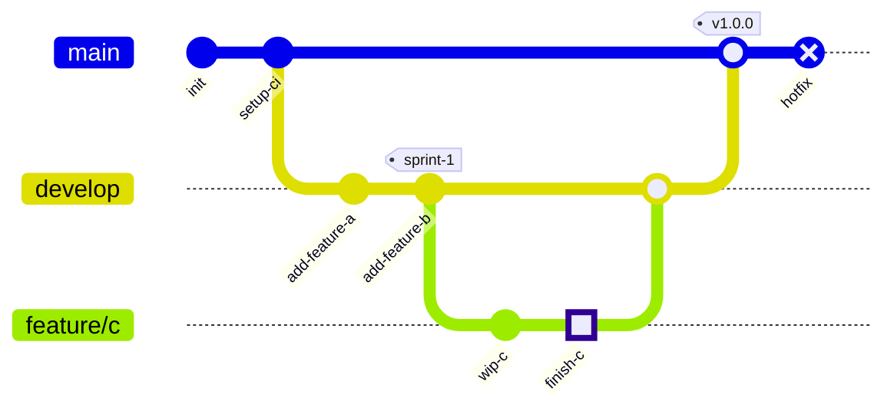

# Git Graph Reference

## Syntax

```
gitGraph
    commit
    commit id: "custom-id"
    branch develop
    checkout develop
    commit type: HIGHLIGHT
    commit tag: "v1.0.0"
    checkout main
    merge develop
    cherry-pick id: "commit-id"
```

## Orientation

```
gitGraph LR:    Left-to-right (default)
gitGraph TB:    Top-to-bottom
gitGraph BT:    Bottom-to-top
```

## Commands

| Command | Description |
|---------|-------------|
| `commit` | New commit on current branch |
| `branch name` | Create and switch to new branch |
| `checkout name` | Switch to existing branch |
| `merge name` | Merge branch into current branch |
| `cherry-pick id: "id"` | Cherry-pick a commit from another branch |

## Commit Attributes

All optional, can combine:

| Attribute | Values | Example |
|-----------|--------|---------|
| `id:` | Custom string | `commit id: "fix-login"` |
| `type:` | `NORMAL`, `REVERSE`, `HIGHLIGHT` | `commit type: HIGHLIGHT` |
| `tag:` | Custom string | `commit tag: "v2.0.0"` |

Merge commits support the same attributes.

## Cherry-Pick Rules

- Must specify `id:` of an existing commit
- Can only cherry-pick from a different branch
- Current branch must have at least one commit
- For merge commits, must specify `parent:` commit ID

## Configuration

```
---
config:
  gitGraph:
    showBranches: false
    showCommitLabel: false
    mainBranchName: "trunk"
    mainBranchOrder: 0
    parallelCommits: false
    rotateCommitLabel: true
---
```

## Common Pitfalls

| Problem | Cause | Fix |
|---------|-------|-----|
| Branch not found | `checkout` to non-existent branch | `branch` creates, `checkout` only switches to existing |
| Merge target not found | Merging non-existent branch | Ensure branch was created with `branch` first |
| Cherry-pick fails | Cherry-picking from same branch or missing `parent:` for merge | Read cherry-pick rules above |
| ID conflicts | Two commits with same custom ID | Use unique IDs |
| Keywords as branch names | Branch name conflicts with syntax keyword | Quote the name: `branch "merge"` |

## Example


