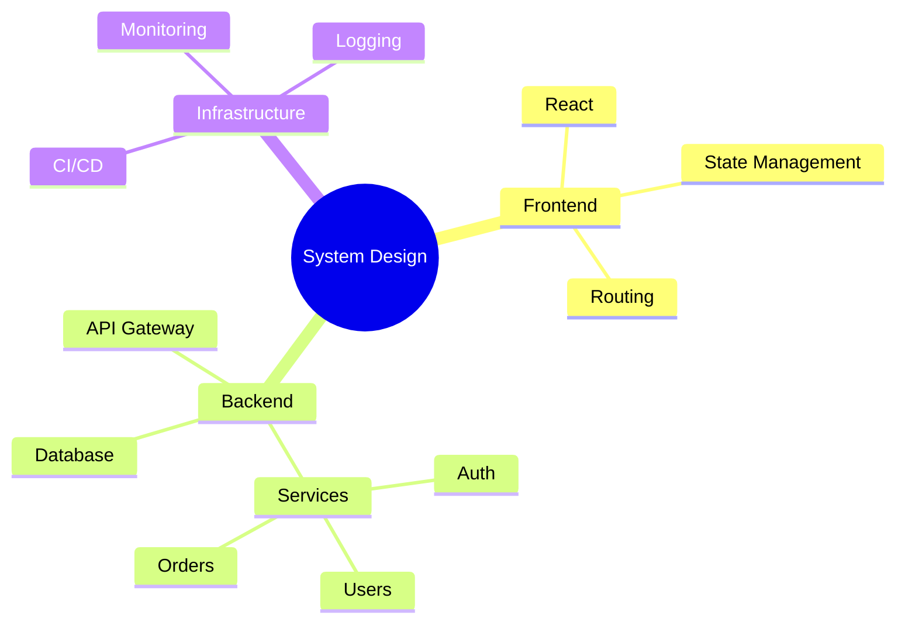

# Mindmap Reference

## Syntax

```
mindmap
    Root
        Branch A
            Leaf A1
            Leaf A2
        Branch B
            Leaf B1
```

Indentation defines hierarchy. Deeper indent = child.

## Node Shapes

| Syntax | Shape |
|--------|-------|
| `id[Text]` | Square |
| `id(Text)` | Rounded square |
| `id((Text))` | Circle |
| `id))Text((` | Bang |
| `id)Text(` | Cloud |
| `id{{Text}}` | Hexagon |
| `Text` | Default (rounded) |

Root can use any shape: `root((Central Idea))`

## Icons

```
::icon(fa fa-book)
```

Requires icon fonts loaded by the host application.

## Classes

```
:::urgent large
```

Applies CSS classes (host-defined).

## Markdown Strings

```
id["`**Bold** and *italic*
with line breaks`"]
```

## Direction & Layout

Default layout is radial. For a tidy-tree layout:
```
---
config:
  layout: tidy-tree
---
mindmap
    root
        A
        B
```

## Common Pitfalls

| Problem | Cause | Fix |
|---------|-------|-----|
| Wrong parent | Ambiguous indentation | Indentation must be strictly deeper than parent. If B is child of A, B must be more indented than A |
| Sibling confusion | Inconsistent indentation | Siblings must have the same indentation level |
| Markdown not rendering | Using traditional strings for formatting | Use `` ["`...`"] `` for markdown strings |
| Icon not showing | Icon font not available | Icons require host-configured font. Skip if unsure |
| Shape + text with special chars | Brackets in the label | Use backtick escaping or avoid brackets in labels |

## Naming Conventions

- Root: central concept, short phrase
- Branches: categories, nouns
- Leaves: specific items, actions, details
- Keep node text short (under 30 characters)

## Example


