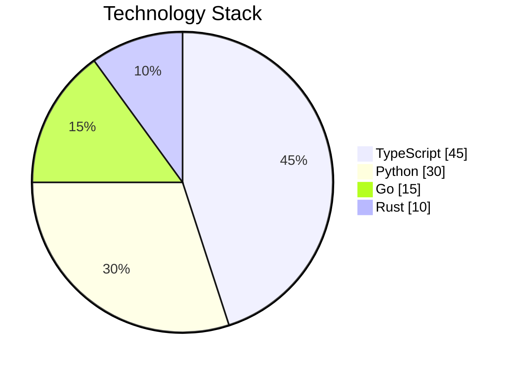

# Pie Chart Reference

## Syntax

```
pie showData
    title Chart Title
    "Label 1" : 42
    "Label 2" : 30
    "Label 3" : 28
```

`showData` is optional — displays values next to legend.

## Donut Chart

Set via YAML frontmatter config:
```
---
config:
  pie:
    donutHole: 0.3
---
pie
    "A" : 50
    "B" : 50
```

## Configuration

| Parameter | Description | Default |
|-----------|-------------|---------|
| `textPosition` | Label distance from center (0.0–1.0) | `0.75` |
| `donutHole` | Donut hole ratio (0.0–0.9) | `0` |
| `legendPosition` | `top`, `bottom`, `left`, `right`, `center` | `right` |
| `highlightSlice` | Label of slice to highlight | none |

```
---
config:
  pie:
    textPosition: 0.5
    legendPosition: bottom
---
pie showData
    title Key Elements
    "Calcium" : 42.96
    "Potassium" : 50.05
    "Iron" : 5
```

## Common Pitfalls

| Problem | Cause | Fix |
|---------|-------|-----|
| Negative values | Pie values must be positive | Use absolute values, or use a different chart type |
| Zero values | Values must be > 0 | Remove zero-value slices or set to a small positive number |
| Label with special chars | Colon or quotes in label | Use backtick quotes: `` `Label: value` `` |
| Decimal precision | More than 2 decimal places | Round to 2 decimal places max |
| Missing colon separator | Space before colon | `"Label" : 42` not `"Label": 42` |

## Example


