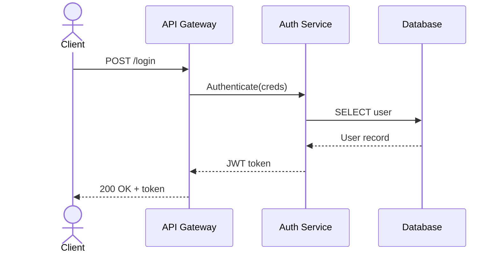

# Sequence Diagram Reference

## Syntax

```
sequenceDiagram
    participant A as Display Name
    actor B as Display Name

    A->>B: Synchronous message
    A-->>B: Async / response
    A->B: Line (no arrowhead)
    A-->B: Dashed line (no arrowhead)
    A-xB: Solid with X end
    A--xB: Dashed with X end
    A-)+B: Open arrow (async activation)
    A-)-B: Closed arrow

    activate B
    deactivate B

    Note left of A: Comment on left
    Note right of B: Comment on right
    Note over A,B: Spanning note
```

## Control Structures

```
    loop Every 5 seconds
        A->>B: Heartbeat
    end

    alt Success case
        A->>B: Request
        B-->>A: OK
    else Failure case
        A->>B: Request
        B-->>A: Error
    end

    opt Optional
        A->>B: Maybe
    end

    par Thread 1
        A->>B: Action
    and Thread 2
        A->>C: Action
    end

    critical Must complete
        A->>B: Critical
    option Timeout
        A->>B: Failed
    end
```

## Participant Types

```
participant A as Service     Standard rectangle
actor U as User              Stick figure (for humans/frontend)
create participant B         Created mid-diagram
destroy B                    Destroyed mid-diagram
box Title over A,B           Group participants visually
```

## Numbering

```
autonumber
```

Adds sequence numbers to messages.

## Common Pitfalls

| Problem | Cause | Fix |
|---------|-------|-----|
| Participant not declared | Using ID without `participant` declaration | Declare all participants before first message |
| Wrong arrow direction | `A<<-B:` instead of `B->>A:` | Arrows always point from sender to receiver. Reverse by swapping participants |
| Missing `as` in declaration | `participant A User` without `as` | Use `participant A as User` |
| Unclosed block | Missing `end` for `loop`/`alt`/`opt`/`par`/`critical` | Every block must have matching `end` |
| Arrow type mismatch | Using `->>` for response | Use `-->>` for async responses, `->>` for sync requests |
| Activations never deactivated | `activate B` without matching `deactivate B` | Always pair activate/deactivate |
| Note spanning undeclared participant | `Note over A,B` but B not declared | Declare all participants referenced in notes |

## Participant Naming Conventions

- Declare all participants at the top, before any messages
- Use short IDs: `GW` for Gateway, `DB` for Database
- Use descriptive `as` labels: `participant GW as API Gateway`
- Order participants left-to-right by call depth (caller on left)
- `actor` for human users and frontend clients

## Message Labeling

- HTTP: `POST /api/users`, `GET /status`
- RPC: `CreateOrder(payload)`, `ValidateToken(tok)`
- Events: `OrderPlaced`, `PaymentProcessed`
- Keep labels under 40 characters

## Example


