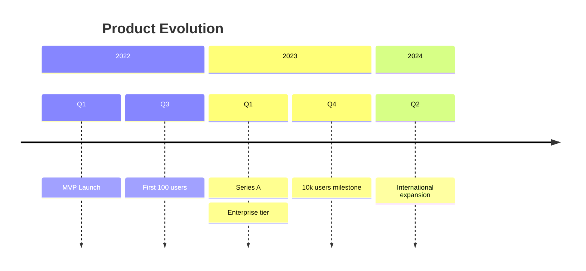

# Timeline Reference

## Syntax

```
timeline
    title Timeline Title
    section Section Name
        Time Period : Event 1
                    : Event 2
                    : Event 3
    section Another Section
        Time Period : Event
```

Or with direction (v11.14.0+):
```
timeline TD
```

Directions: `LR` (left-to-right, default), `TD` (top-to-bottom).

## Time Periods and Events

Each line: `Time Period : Event`

Multiple events per time period (any of these):
```
2024 : Event A : Event B
2024 : Event A
     : Event B
```

## Sections

Group time periods visually:
```
section 2024 Q1
    January : Launch v1
    February : Bug fixes
section 2024 Q2
    March : Launch v2
```

Each section gets a distinct color.

## Line Breaks

Use `<br>` within event text for manual line breaks.

## Styling

Disable per-section coloring:
```
---
config:
  timeline:
    disableMulticolor: true
---
```

Custom colors via theme variables:
```
---
config:
  themeVariables:
    cScale0: '#ff0000'
    cScaleLabel0: '#ffffff'
---
```

Up to 12 sections supported (`cScale0`–`cScale11`).

## Common Pitfalls

| Problem | Cause | Fix |
|---------|-------|-----|
| Events merge unexpectedly | Missing colon before event | `2024 : Event` not `2024 Event` |
| Section doesn't appear | `section` keyword on wrong line | `section Name` must be on its own line |
| Color repeats after 12 sections | Only 12 color slots | Limit to 12 sections |
| Long event text overflows | Text too long | Use `<br>` for line breaks |

## Naming Conventions

- Time periods: short, consistent format (`2024 Q1`, `January 2024`, `Phase 1`)
- Events: past tense or descriptive (`Launched v1`, `Migrated database`)
- Sections: group by theme, quarter, or phase

## Example


