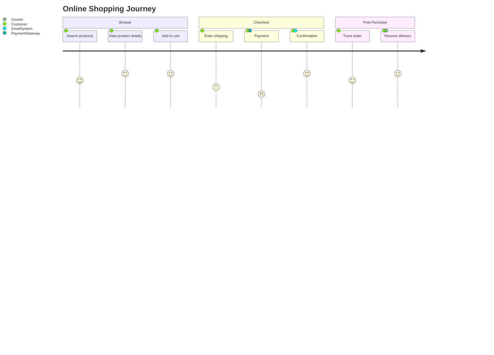

# User Journey Reference

## Syntax

```
journey
    title Journey Title
    section Section Name
        Task description: Score: Actor1, Actor2
        Another task: Score: Actor
    section Next Section
        Task: Score: Actor
```

Score is an integer 1–5 (higher = better experience).

## Structure

Each user journey:
1. `title` — optional title
2. `section` blocks — group related tasks
3. Task lines — `Task name: <score>: <actors>`

Multiple actors separated by commas: `Actor1, Actor2, Actor3`

## Example



## Common Pitfalls

| Problem | Cause | Fix |
|---------|-------|-----|
| Invalid score | Score outside 1–5 range | Use integers 1–5 only |
| Missing colon after task | Wrong task syntax | `Task: 3: Actor` not `Task 3: Actor` |
| Wrong separator between score and actor | Used `-` or `>` | Use colon: `Task: 3: Actor` |
| Actor list parsing error | Extra spaces or special chars | Use simple names, comma-separated |
| Too many actors | Long actor list | Keep to 2–3 actors per task |

## Naming Conventions

- Sections: phases of the journey (`Browse`, `Checkout`, `Support`)
- Tasks: verb phrases describing user action (`Search products`, `Enter payment`)
- Actors: role names (`Customer`, `Admin`, `SupportAgent`)
- Keep task descriptions short (under 40 characters)
